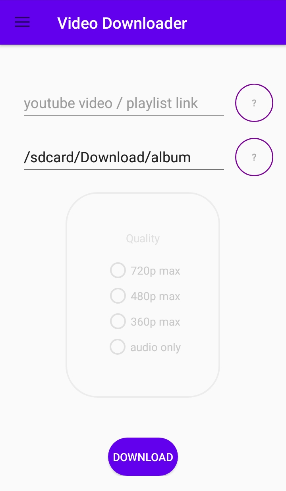

# Android-Youtube-Downloader 1.3.1
An Android Youtube downloader based on yt-dlp, pytube and Chaquopy.
You can download in mp4/m4a youtube videos/playlists. This application work for many other websites ([see yt-dlp supported website](https://github.com/yt-dlp/yt-dlp/blob/master/supportedsites.md))
***
## Compatibility
Compatible with android 8 to android 10.
Due security policies on some Android systems, the application doesn't work on Android 11 and newer versions. The next version of the application will solve the issue.
[A version for linux is also available](https://github.com/acmo0/youtube-downloader-linux).
## Download
[Download from our github repository.](https://github.com/acmo0/Android-Youtube-Downloader/releases/tag/v1.3.1)
## Lastest release improvements v1.3.1
Release from August 2022
1. *Solve bug* (link update problem with sharing video from youtube when the app is already started)

## Screenshots

    
## Privacy
This application does not collect any user information.
## Credits
1. [Chaquopy](https://chaquo.com/chaquopy/) MIT License
2. [yt-dlp](https://github.com/yt-dlp/yt-dlp) The Unlicense
3. [pytube](https://github.com/pytube/pytube) The Unlicense
4. [ffmpeg-android-java](https://github.com/WritingMinds/ffmpeg-android-java) GPLv3.0

## Issues
Please feel free to open an issue if you want some new features, find a bug,...

